# National University AI Assistant — Comprehensive Performance Audit

## 1. Executive Summary & Root Cause Breakdown

A rigorous empirical performance investigation was executed to diagnose why a simple `"hi"` or initial query takes **10.58 seconds** in the National University AI Assistant chat interface.

### Summary of Measured Bottlenecks (Baseline vs Real Cost)

| Component / Layer | Observed Latency | Root Cause |
| :--- | :--- | :--- |
| **1. Intent Routing & Fast-Path Gap** | **6,500 – 10,000 ms** | Queries like `"hi"` or `"হ্যালো"` did not short-circuit. Instead, they triggered the full heavyweight RAG context retrieval pipeline. |
| **2. Redundant Embedding API Calls** | **7,000 – 9,500 ms** | `token_service.find_similar_solved_cases` and `vector_store.similarity_search` were called sequentially, triggering two consecutive remote Google GenAI Embedding API calls on the same turn. |
| **3. Model Configuration Mismatch** | **18,500 – 50,000 ms** | `backend/config.py` configured `gemini-3.6-flash` and deprecated `gemini-2.5-flash` fallbacks. `gemini-3.6-flash` takes **18.5s** per turn compared to **~1.1s** on `gemini-3.1-flash-lite`. Retrying non-existent/high-demand models introduced 10–50s retry cascades. |
| **4. Lack of Token Streaming (SSE)** | **Entire response wait** | The frontend used blocking `fetch('/api/chat')`, forcing the user to wait for the entire multi-paragraph LLM response to complete before receiving the first byte. |
| **5. Sequential Execution Pipeline** | **Cumulative delay** | Database queries (SQL FAQs, Notices), Chroma vector lookups, and MCP operations were executed sequentially instead of in parallel via `asyncio.gather` / `ThreadPoolExecutor`. |

---

## 2. Empirical Profiling Data (Per-Component)

```mermaid
gantt
    title Latency Waterfall of a Single Request (Before Optimization)
    dateFormat X
    axisFormat %s s
    section Baseline (10.58s - 25.07s)
    Intent Classification : 0, 1
    Solved Cases Embedding Call (Remote) : 1, 7000
    Chroma Vector Search (Remote Embed) : 7000, 7600
    SQL FAQ & Notices Query : 7600, 7640
    LLM Synchronous Blocking Generation : 7640, 25070
```



### Component-by-Component Latency Measurements:
1. **SQL Database (SQLite):** `0.72 ms – 3.78 ms` (Extremely fast, negligible overhead).
2. **Intent Classification (Regex/Rule-based):** `0.01 ms – 0.04 ms` (Instantaneous).
3. **Token Service Similar Cases Search (Embeddings + Vector):** `6,520 ms – 9,786 ms` (Major bottleneck due to remote embedding roundtrips).
4. **ChromaDB Vector Store Query Embedding:** `456 ms – 594 ms` (Remote network API call to `gemini-embedding-001`).
5. **Google GenAI Generation (`generate_content` blocking):**
   - `gemini-3.6-flash`: `18,522 ms` (18.5s)
   - `gemini-3-flash-preview`: `2,111 ms – 4,650 ms`
   - `gemini-3.1-flash-lite`: `1,160 ms` (Non-streaming) / `1,211 ms` (TTFT with Streaming)
   - `gemini-3.5-flash-lite`: `980 ms` (Non-streaming) / `1,246 ms` (TTFT with Streaming)

---

## 3. Detailed Root Causes

### Root Cause 1: Greeting & Short Queries Triggered Full RAG
When a user typed `"hi"`, the `classify_intent("hi")` returned `"greeting"`. However, `rag_engine.py` lacked an immediate fast return branch for greetings before calling `retrieve_context(query, intent)`. As a result, `"hi"` went through:
- Solved cases similarity search (Embeddings API)
- FAQ search in SQLite
- ChromaDB vector similarity search (Embeddings API)
- Gemini model generation

### Root Cause 2: Double Remote Embedding Generation
In `retrieve_context()`:
```python
# Call 1: Calls Chroma similarity search -> triggers Google embedding API
similar_solved = self.token_service.find_similar_solved_cases(query, top_k=2)

# Call 2: Calls Chroma similarity search AGAIN -> triggers Google embedding API AGAIN
vector_results = self.vector_store.similarity_search(query, k=5)
```
This resulted in 2 sequential network round-trips to Google's embedding servers for the exact same input string.

### Root Cause 3: Model Configuration & Deprecation Cascades
The fallback list in `backend/config.py` contained models that returned `404 NOT_FOUND` (e.g. `gemini-2.5-flash` for new users) and `503 UNAVAILABLE` (e.g. `gemini-3.7-flash`). Each failure triggered a `time.sleep(1.0)` and retried, blowing latency from 5s up to 50s.

### Root Cause 4: Synchronous Non-Streaming Frontend-Backend Link
The web interface in `static/index.html` and widget in `static/widget.js` used a traditional `POST /api/chat` request that only resolved when the entire response string was delivered. The user experienced 100% idle spinner time.

---

## 4. Architectural Fix Strategy & Roadmap

1. **Intelligent Fast Router (< 5ms):**
   - Greetings, static FAQ matches, and token status queries resolve immediately without activating RAG or calling LLMs.
2. **Parallel Context Retrieval (< 500ms):**
   - Concurrently execute SQL notices, Chroma vector search, and token solver lookups with `asyncio.gather` / `ThreadPoolExecutor`.
   - Single cached embedding computation per query.
3. **Model Tier Optimization (`gemini-3.1-flash-lite` / `gemini-3.5-flash-lite`):**
   - Primary: `gemini-3.1-flash-lite` (TTFT ~1.2s, ultra-fast Bangla generation).
   - Fallback: `gemini-3.5-flash-lite`, `gemini-3-flash-preview`.
4. **Server-Sent Events (SSE) Streaming Pipeline:**
   - Real-time chunked token streaming to `static/index.html` and `static/widget.js`.
   - Time-to-First-Token (TTFT) drops to **< 1.2s** for generative queries and **< 0.01s** for routed queries.
