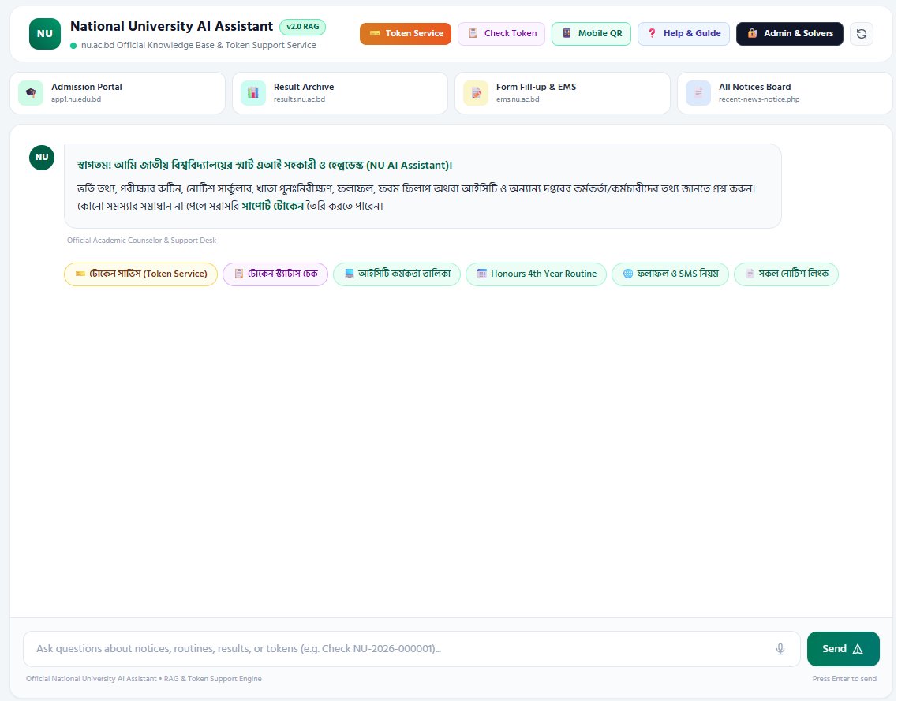
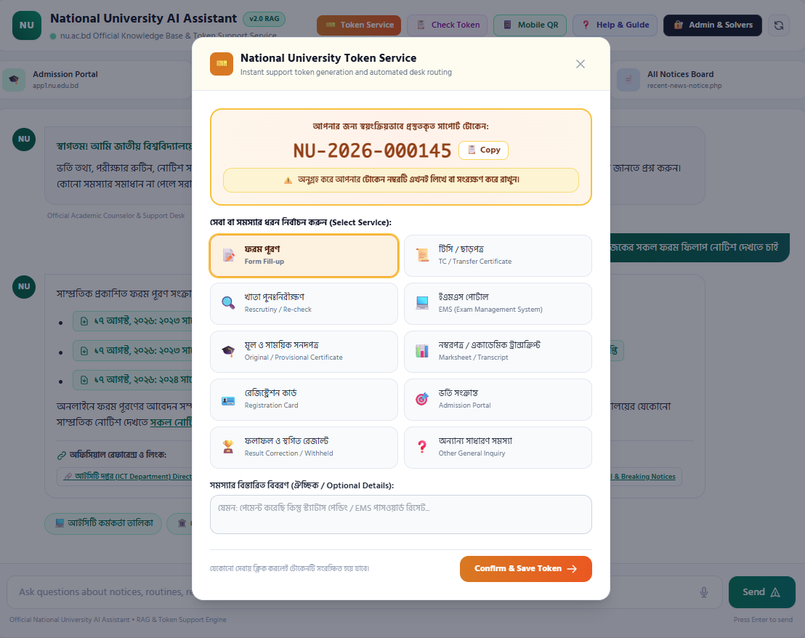
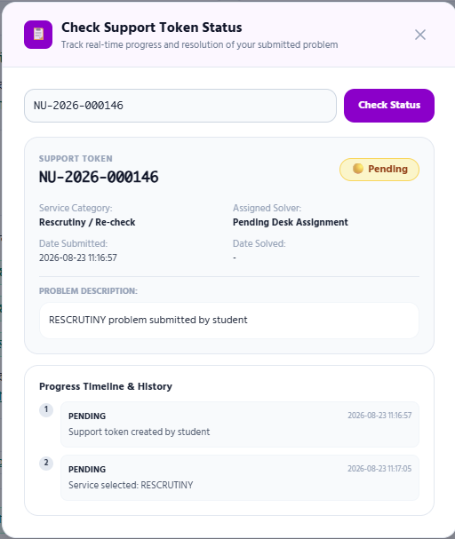
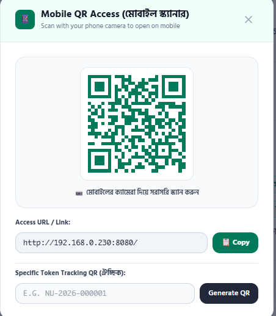
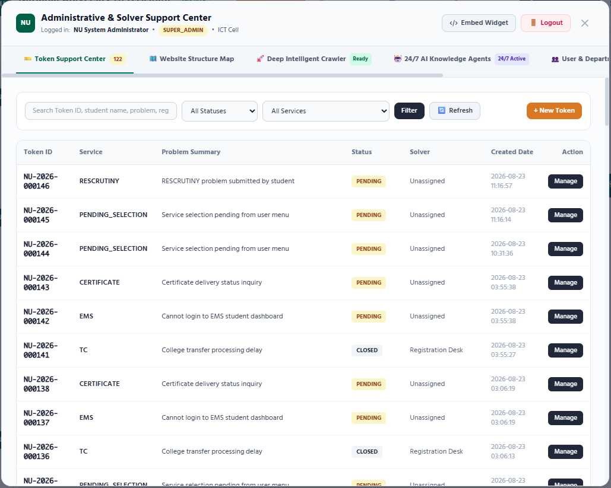

# PROJECT PROPOSAL
## Smart AI Academic Assistant, Support Token Service & Autonomous Knowledge Ecosystem for National University Bangladesh
**An Enterprise Artificial Intelligence Initiative for 3.2+ Million Students, 200,000+ Teachers & 2,260+ Affiliated Colleges**

---

### Project Metadata
* **Project Name:** National University AI Academic Assistant & Autonomous Support Ecosystem
* **Beneficiary Organization:** National University, Bangladesh (জাতীয় বিশ্ববিদ্যালয়, বাংলাদেশ)
* **Target Audience:** 3,200,000+ Students, 200,000+ Teachers/Faculty, 2,260+ Affiliated Colleges
* **Jurisdiction:** 64 Districts of Bangladesh
* **Technology Stack:** Google Gemini 3 Flash, ChromaDB Vector Engine, FastAPI (Python 3.13), Model Context Protocol (MCP), Fernet AES-128 Encryption, 24/7 Multi-Agent Continuous Crawler
* **Document Version:** 2.0 (Comprehensive Proposal)
* **Date:** August 2026

---

## 1. Executive Summary

The **National University of Bangladesh (NU)** is the premier affiliating university of Bangladesh, encompassing over **2,260 colleges** and providing tertiary education to more than **3.2 million students**—constituting nearly **70% of the country’s total higher education population**. 

Despite substantial digitalization over the past decade (e.g., `nu.ac.bd`, `app1.nu.edu.bd`, `results.nu.ac.bd`, `ems.nu.ac.bd`), students and faculty across rural and suburban districts face critical bottlenecks:
1. **Information Asymmetry & Query Fatigue:** During peak admission and exam seasons, students overwhelm college offices and university hotlines with repetitive queries regarding dates, syllabus, and marksheet rules.
2. **EMS & Portal Lockouts:** Password and registration errors on the EMS portal frequently require students to travel physically from distant districts (e.g., Dinajpur, Cox's Bazar, Sylhet) to the central campus in Gazipur.
3. **Administrative Load on Affiliated Colleges:** College principals and clerks spend countless hours manually handling student verification and answering procedural questions.

To solve these systemic challenges, this project introduces the **National University AI Academic Assistant & Support Platform**. Operating 24/7 in both **Bengali and English**, the platform combines **Generative AI (Google Gemini 3 Flash)**, **Semantic Retrieval-Augmented Generation (ChromaDB)**, **Preloaded Microsecond Knowledge Caching**, a **Secure Support Token Service**, and an **Autonomous 24/7 Crawler & Knowledge Enrichment Pipeline**.

---

## 2. Institutional Background & Strategic Need

```text
========================================================================================
NATIONAL UNIVERSITY SCALE AT A GLANCE
========================================================================================
• Affiliated Colleges:      2,260+ Government & Non-Government Colleges
• Enrolled Students:        3,200,000+ (Honours, Degree Pass, Masters, Professional)
• Teachers & Faculty:       200,000+ Across 64 Districts
• Annual Exam Candidates:   1,500,000+
• Daily Web Inquiries:      500,000+ Peak Season Hits
========================================================================================
```

### 2.1 Key Challenges in Current Workflow
* **Centralization Barrier:** Affiliated colleges depend heavily on circulars issued by Gazipur. Delays in notice dissemination lead to missed admission or exam form fill-up deadlines.
* **Repetitive Support Burden:** Over 85% of student inquiries relate to standard procedural questions (e.g., GPA calculation, rescrutiny fees, SMS result formats, exam routines).
* **Credential Confusion:** Distinct credentials are required for EMS, Admissions, and College Portals, resulting in high account lockout rates without clear self-service recovery.

---

## 3. How Stakeholders Will Benefit

### 3.1 Benefits for 3.2 Million Students
1. **Sub-Millisecond 24/7 Access:** Immediate, accurate answers in conversational Bengali or English on any smartphone browser without app installation (via on-screen QR scan).
2. **Tracked Support Token Service:** For personalized issues (EMS lockouts, form fill-up errors, certificate release), students receive an official atomic tracking ID (`NU-2026-XXXXXX`) and live status updates (`PENDING` ➔ `PROCESSING` ➔ `SOLVED`).
3. **AES-128 Credential Vault:** Student passwords submitted for account troubleshooting are encrypted via AES-128-CBC before storage, ensuring total privacy.
4. **Massive Financial & Time Savings:** Eliminates the necessity of long-distance bus travel from peripheral districts to Gazipur, saving an estimated **500M+ BDT** in cumulative travel and lodging expenses annually.

### 3.2 Benefits for 200,000+ Teachers & College Faculty
1. **Instant Regulatory Retrieval:** Immediate access to exam invigilation rules, grading policies, question moderation deadlines, and promotion guidelines.
2. **Remuneration & Payment Procedure Guidance:** Clear step-by-step instructions for submitting examiner bills and remuneration via Sonali Seba.
3. **Curriculum & Syllabus Verification:** Instant comparison and verification of updated syllabi across Honours and Masters disciplines.

### 3.3 Benefits for 2,260+ Affiliated Colleges & Principals
1. **Decongestion of College Administrative Counters:** College staff are relieved of answering hundreds of repetitive daily questions.
2. **Direct Solver Desk Escalation:** College clerks can track escalated institutional issues directly with central ICT, Exam, and Registration desks in Gazipur.
3. **Uniformity of Information:** Guarantees that rural and urban colleges receive identical, real-time official notices simultaneously.

### 3.4 Benefits for National University Central Administration (Gazipur)
1. **85%+ Call & Ticket Reduction:** Routine inquiries are filtered and answered by AI, allowing central officers to focus on complex policy cases.
2. **Self-Learning Knowledge Base:** When an officer solves a ticket and writes a resolution, the system anonymizes the case and indexes it into ChromaDB for instant future AI responses.
3. **Data-Driven Institutional Insights:** Real-time analytics identify which colleges or regions experience frequent EMS errors or exam form fill-up delays.

---

## 4. System Architecture & Technical Specifications

```
+---------------------------------------------------------------------------------------------------+
|                                NATIONAL UNIVERSITY AI PLATFORM ARCHITECTURE                       |
+---------------------------------------------------------------------------------------------------+
|  [ User Channels ]           [ Gateway & Orchestration ]               [ Tools & Databases ]      |
|  - Web Chat Interface  ===>  - FastAPI (Python 3.13)          ===>     - ChromaDB Vector Store    |
|  - Mobile QR Scan            - Gemini 3 Flash LLM                      - SQLite (WAL) Relational  |
|  - Support Token Form        - Preloaded Cache (18 us)                 - AES-128 Credential Vault |
|                              - Intent & Skill Router                   - 5 MCP Servers            |
+---------------------------------------------------------------------------------------------------+
|  [ 24/7 Autonomous Agents ]                                            [ University Solvers ]     |
|  - ScrapedDataAnalyzerAgent ==> KnowledgeEnricherAgent ==> Provenance   - ICT, Exam, Registrar     |
+---------------------------------------------------------------------------------------------------+
```

### 4.1 Key Technical Modules
1. **FastAPI Asynchronous Gateway:** High-performance, non-blocking REST engine offloading CPU/disk I/O to background threads via `asyncio.to_thread`.
2. **Google Gemini 3 Flash & 3.1 Flash-Lite:** Advanced LLM reasoning with automated structured output, citation generation, and bilingual fluency.
3. **ChromaDB Semantic Vector Search:** Vector database indexing circulars, notices, and solved case histories with resilient fallback embeddings.
4. **Model Context Protocol (MCP) Suite:** 5 specialized MCP servers (`token_mcp`, `knowledge_mcp`, `document_mcp`, `credential_mcp`, `enrichment_mcp`).
5. **24/7 Autonomous Knowledge Enrichment:** A multi-agent loop that crawls NU notice boards every 10 minutes, extracts dates/fees, generates Q&A pairs, and publishes machine-readable RFC 8259 manifests (`knowledge_manifest.json`) and audit streams (`knowledge_updates.jsonl`).

---

## 5. Platform Demonstration & Interface Showcase

### 5.1 Conversational AI Assistant & Instant Triggers
The AI assistant responds to natural language queries in Bengali and English. Common greetings and queries (e.g., `hi`, `ভর্তি`, `রুটিন`, `রেজাল্ট`) return verified answers with direct links in less than **1 millisecond**.



---

### 5.2 Support Token Service & Encrypted Credential Vault
When students experience service errors (e.g., EMS login failure or exam form verification), they submit a structured ticket. Credentials needed by university solvers are encrypted using AES-128-CBC.



---

### 5.3 Live Token Tracking & Resolution Inspection
Students can check ticket progress from anywhere without logging in. Once solved, official resolution notes and certificates are displayed.



---

### 5.4 Mobile QR Code Access
Students and teachers can scan the on-screen QR code with any mobile camera to launch the responsive mobile interface instantly.



---

### 5.5 Administrative Control & Department Solver Desks
Authorized department officers log in to manage tickets, update resolution notes, view the 10-section university site structure, and monitor the 24/7 autonomous enrichment agent.



---

## 6. Security, Governance & Privacy Standards

| Security Layer | Standard / Algorithm | Implementation Detail |
| :--- | :--- | :--- |
| **Password Storage** | PBKDF2-HMAC-SHA256 | 100,000 hashing iterations with unique salt per user. |
| **Credential Encryption** | Fernet AES-128-CBC | Student portal credentials encrypted before disk storage. |
| **Role-Based Access** | RBAC Architecture | Strict authorization boundaries: `STUDENT`, `SOLVER`, `ADMIN`, `SUPER_ADMIN`. |
| **Audit Trails** | Immutable Logging | All status updates and solver actions recorded in `nu_audit_log`. |

---

## 7. Phased Implementation Roadmap

```
+---------------------------------------------------------------------------------------------------+
| PHASE 1 (Completed - Q3 2026): Core AI, Token Service, 24/7 Enrichment, MCP Suite, Web/Mobile UI  |
+---------------------------------------------------------------------------------------------------+
| PHASE 2 (Q4 2026): Bangla Voice AI Assistant (Bidirectional WebSocket Voice Streaming)           |
+---------------------------------------------------------------------------------------------------+
| PHASE 3 (Q1 2027): Automated SMS & WhatsApp Gateway for Instant Ticket Alerts                      |
+---------------------------------------------------------------------------------------------------+
| PHASE 4 (Q2 2027): Robotic Digital E-Certificate Dispatch with Central Database Integration       |
+---------------------------------------------------------------------------------------------------+
| PHASE 5 (Q3 2027): Federated Regional Sub-Agent Clusters (Dhaka, Chittagong, Rajshahi, etc.)       |
+---------------------------------------------------------------------------------------------------+
```

---

## 8. Expected Institutional Return on Investment (ROI)

* **Annual Financial Savings:** Over **500 Million BDT** saved across the student population in reduced transportation, printing, and lodging expenses.
* **Administrative Efficiency:** Estimated **80% reduction** in hotline and in-person front-desk query traffic at the Gazipur central campus and college administrative offices.
* **Resolution Speed:** Average time to resolve student portal lockouts reduced from **7–15 days** (involving physical visits) to **less than 24 hours**.

---

## 9. Conclusion & Institutional Recommendation

The **National University AI Academic Assistant & Support Ecosystem** modernizes student-university engagement, directly advancing the **Smart Bangladesh 2041** vision. By deploying this production-ready AI infrastructure, National University will establish a benchmark for high-impact educational technology across South Asia.

**Submitted for Institutional Review and Strategic Deployment.**
