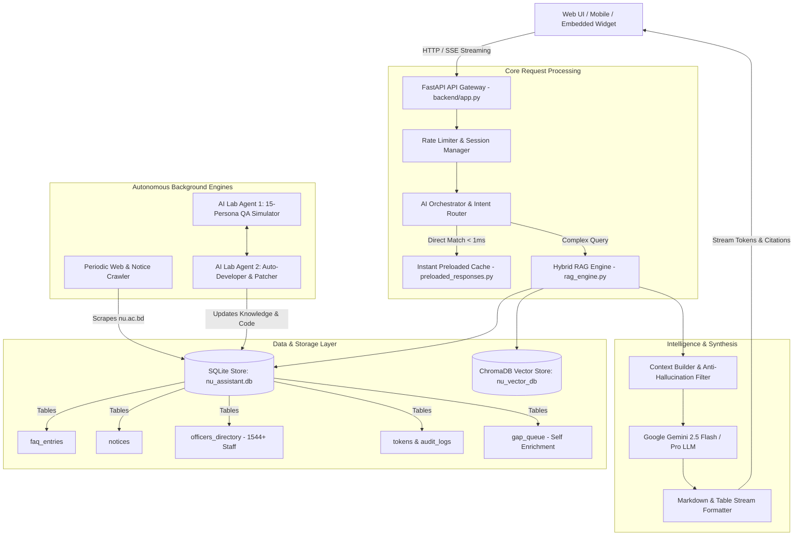
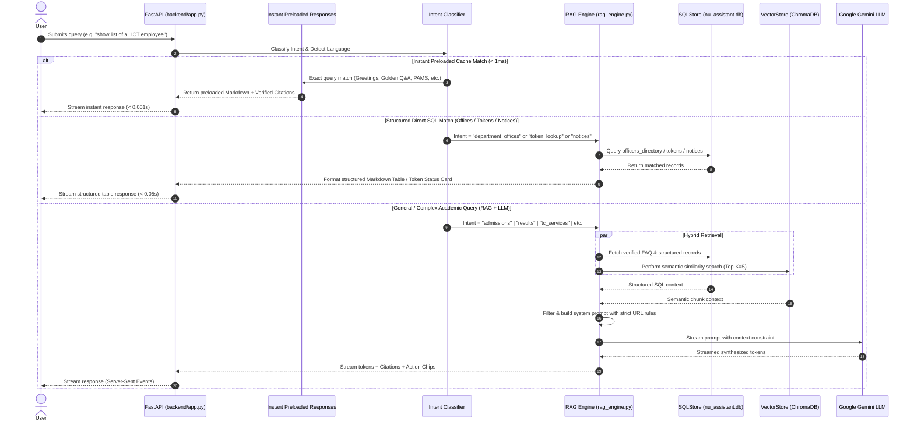
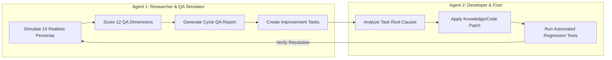

# 🏛️ National University Bangladesh AI Assistant — Architecture & Program Structure (`structure.md`)

> **Comprehensive Technical Architecture, Subsystems, Data Flow, RAG Engine, and Operational Manual**  
> *Target Audience:* Developers, DevOps Engineers, AI Architects, and Automated Subagents.

---

## 📑 Table of Contents
1. [System Overview & Objectives](#1-system-overview--objectives)
2. [High-Level Architecture Diagram](#2-high-level-architecture-diagram)
3. [Full Directory & Component Tree](#3-full-directory--component-tree)
4. [How Queries Are Processed & Answered (Query Execution Flow)](#4-how-queries-are-processed--answered-query-execution-flow)
5. [RAG Engine & Multi-Tier Retrieval Pipeline](#5-rag-engine--multi-tier-retrieval-pipeline)
6. [Department & Officers Directory System (All 33 Offices)](#6-department--officers-directory-system-all-33-offices)
7. [Helpdesk Token Support Center & Solver Desk Architecture](#7-helpdesk-token-support-center--solver-desk-architecture)
8. [Autonomous 24/7 AI Lab (Agent 1 & Agent 2 Loop)](#8-autonomous-247-ai-lab-agent-1--agent-2-loop)
9. [Database Schemas & Storage Layer](#9-database-schemas--storage-layer)
10. [REST APIs & Server-Sent Events (SSE) Streaming](#10-rest-apis--server-sent-events-sse-streaming)
11. [Model Context Protocol (MCP) & Agent Skills](#11-model-context-protocol-mcp--agent-skills)
12. [Security, RBAC, and Anti-Hallucination Guardrails](#12-security-rbac-and-anti-hallucination-guardrails)
13. [Deployment, Administration & Desktop Control Panels](#13-deployment-administration--desktop-control-panels)
14. [Testing Suite & Verification Commands](#14-testing-suite--verification-commands)

---

## 1. System Overview & Objectives

The **National University Bangladesh AI Academic Assistant** is an enterprise-grade, multi-agent AI platform built to serve over **2.5 million students, teachers, college administrators, and staff** across **2,200+ affiliated colleges** under the National University (NU), Gazipur, Bangladesh.

### Core Objectives:
1. **Instant, Accurate Academic Support:** Provide 24/7 conversational assistance in **Bangla (বাংলা), English, and Banglish (phonetic script)** for admissions, examinations, results, certificate issuance, college transfer (TC), document corrections, and fees.
2. **Strict Official Domain Compliance:** Strictly guide users to authentic NU portals and eliminate hallucinations or deprecated URLs.
3. **Structured Administrative Helpdesk:** An integrated support ticketing/token workflow routing complex student issues to dedicated department solver desks with RBAC enforcement.
4. **Autonomous Self-Improvement (AI Lab):** Continuous 24/7 dual-agent self-testing (Agent 1 QA Persona Simulator + Agent 2 Developer/Fixer) guaranteeing >= 9.0/10 answer quality.
5. **Complete Employee & Department Transparency:** Instant search and tabular directory listings for all **33 official administrative departments** and **1,544+ officers & staff**.

---

## 2. High-Level Architecture Diagram



---

## 3. Full Directory & Component Tree

```
AI_CHAT_BOT/
├── AGENTS.md                          # Critical Agent memory, domain rules, and official URLs
├── AGENTIC_ARCHITECTURE.md            # Exhaustive architectural specification & role hierarchies
├── structure.md                       # Complete program structure & operational guide (This file)
├── main.py                            # Fast server launcher (uvicorn backend.app:app)
├── requirements.txt                   # Production Python dependencies
├── Dockerfile & docker-compose.yml     # Containerized deployment configurations
├── control_panel.py                   # PyQt / Tkinter Desktop System Control Panel
├── service_manager_gui.py             # Desktop Service Manager for Windows/Linux
│
├── backend/                           # FastAPI Core Application Backend
│   ├── app.py                         # FastAPI App initialization, middleware, routes, lifespan
│   ├── config.py                      # Global application settings & environment configs
│   ├── models.py                      # Pydantic data schemas (ChatRequest, ChatResponse, Citations)
│   ├── rag_engine.py                  # Hybrid RAG Engine, Intent Classifier, Fast Formatters
│   ├── rate_limiter.py                # IP & Session rate limiting middleware
│   │
│   ├── api/                           # Modular V1 REST API Route Handlers
│   │   ├── auth_routes.py             # User login, JWT token issuance, session refresh
│   │   ├── chat_routes.py             # /api/chat & /api/chat/stream SSE endpoints
│   │   ├── token_routes.py            # Public student support ticket lookup & creation
│   │   ├── admin_routes.py            # Administrative user, token, and system management
│   │   ├── credential_routes.py       # Encrypted credentials & API key vault
│   │   ├── enrichment_routes.py       # Gap-queue inspection, manual trigger & approval
│   │   ├── ai_lab_routes.py           # AI Lab 24/7 cycle status, trigger, and metrics
│   │   └── mcp_routes.py              # Model Context Protocol status & tools
│   │
│   ├── core/                          # Security, Database Initializer & Audit Logging
│   │   ├── database.py                # SQLite core database connection pool
│   │   ├── security.py                # Password hashing (bcrypt), JWT verification, RBAC
│   │   └── audit.py                   # Immutable administrative action logging
│   │
│   ├── orchestrator/                  # Smart Intent Routing & Zero-Latency Preloader
│   │   ├── agent.py                   # Multi-Agent orchestrator
│   │   ├── intent.py                  # Semantic intent classification rules (40+ domains)
│   │   ├── preloaded_responses.py     # Zero-latency instant answers (< 0.001s)
│   │   ├── router.py                  # Query routing pipeline
│   │   └── skill_registry.py          # Operational skill loader
│   │
│   └── services/                      # Business Logic & Integration Services
│       ├── token_service.py           # Ticket lifecycle, solver assignment, soft-delete
│       ├── activity_tracker.py        # System metrics & analytics recorder
│       ├── backup_service.py          # Automated SQLite database backup & restoration
│       ├── report_exporter.py         # PDF & Excel executive report generation
│       ├── credential_service.py      # Secure key & secret management
│       ├── qa_sync_service.py         # JSON Q&A to SQLite/ChromaDB sync engine
│       └── hermes_brain_service.py    # Adaptive memory & learning service
│
├── token_service/                     # Enterprise Support Ticket/Token Management Subsystem
│   ├── models.py                      # Token data models & Status enums
│   ├── db.py                          # Token SQLite database setup & migrations
│   ├── repository.py                  # Token database queries, department filtering & trash bin
│   ├── routes.py                      # Solver & Admin token endpoints
│   └── service.py                     # Business rules (Solve, Send Back, Reassign)
│
├── ai_lab/                            # Autonomous 24/7 Multi-Agent QA & Self-Improvement
│   ├── agent1_researcher_qa.py        # Agent 1: 15-Persona User Simulation & 12-Metric Scorer
│   ├── agent2_developer_fixer.py      # Agent 2: Automated Task Analyzer, Patcher & Test Runner
│   ├── orchestrator_loop.py           # Controlled continuous execution loop & cooldown manager
│   ├── lab_state.py                   # Shared thread-safe state manager & metrics tracker
│   ├── cycle_reports/                 # JSON logs of executed AI Lab QA cycles
│   └── tasks/                         # Automated tasks generated by Agent 1 for Agent 2
│
├── crawler/                           # Web Crawlers & Scraping Engine
│   ├── scheduler.py                   # Periodic background scraper (APScheduler)
│   ├── nu_crawler.py                  # Scraper for nu.ac.bd notices, circulars & syllabi
│   └── deep_crawler_bridge.py         # Deep recursive crawler for multi-level portal scraping
│
├── db/                                # Storage & Persistence Engine
│   ├── schema.sql                     # Master SQLite database schema
│   ├── sql_store.py                   # High-level SQLStore CRUD manager
│   └── vector_store.py                # ChromaDB vector embedding & similarity search
│
├── data/                              # Datasets & Database Files
│   ├── nu_assistant.db                # Master SQLite database (Notices, Officers, FAQs, Gaps)
│   ├── nu_qa_dataset.json             # 106+ Verified Golden Q&A records
│   └── nu_knowledge_base.json         # Structured knowledge base modules
│
├── static/                            # Frontend Web Application & Client Assets
│   ├── index.html                     # Responsive Glassmorphic Single-Page Application (SPA)
│   ├── widget.js                      # Embeddable zero-dependency chat widget for external websites
│   └── embed-demo.html                # Widget integration demonstration page
│
├── mcp_servers/                       # Model Context Protocol (MCP) Server Toolkits
│   ├── crawler_mcp/                   # MCP tools for crawling & scraping
│   ├── knowledge_mcp/                 # MCP tools for vector & keyword knowledge lookups
│   ├── token_mcp/                     # MCP tools for ticket creation & resolution
│   ├── document_mcp/                  # MCP tools for PDF/Document parsing
│   ├── credential_mcp/                # MCP tools for credentials management
│   └── enrichment_mcp/                # MCP tools for gap analysis
│
├── skills/                            # 16 Specialized Operational Agent Skills
│   ├── admission/                     # Honours, Degree, Masters, Professional admission rules
│   ├── examination/                   # Form fill-up, exam routine, admit card rules
│   ├── result/                        # CGPA calculation, SMS format, rescrutiny challenge
│   ├── token_service/                 # Support ticket creation & department desk routing
│   └── continuous_knowledge_enrichment/ # Gap-queue auto-learning skill
│
└── tests/                             # Comprehensive Automated Test Suite
    ├── test_token_service_domain.py   # Domain compliance & Solver role access control tests
    ├── test_token_service.py          # Token CRUD, status transitions & trash tests
    ├── test_security_rbac.py          # RBAC authentication & authorization tests
    ├── test_deep_crawler.py           # Web scraping & parser validation tests
    ├── test_24x7_enrichment.py        # Gap queue & auto-learning tests
    └── run_all_tests.py               # Master test runner executing the complete suite
```

---

## 4. How Queries Are Processed & Answered (Query Execution Flow)

Every student or administrator query flows through a **5-tier pipeline** designed for maximum speed, strict domain accuracy, and zero hallucinations:



---

## 5. RAG Engine & Multi-Tier Retrieval Pipeline

The RAG Engine located at [`backend/rag_engine.py`](file:///E:/projects/AI_CHAT_BOT/backend/rag_engine.py) implements intelligent query handling:

### 1. Intent Classification Engine (`classify_intent`)
Identifies student intentions across 40+ domain triggers:
- `token_lookup`: Regex pattern `\b(NU-\d{4}-\d{6})\b` or "টোকেন চেক".
- `token_service_menu`: "create token", "টোকেন খুলব", "সমস্যা জানাতে চাই".
- `department_offices`: "দপ্তর", "কর্মকর্তা তালিকা", "ICT employee", "রেজিস্ট্রার".
- `tc_services`: "TC", "কলেজ পরিবর্তন", "transfer certificate", "ছাড়পত্র".
- `admissions`: "ভর্তি", "merit list", "release slip", "eligibility".
- `document_correction`: "সংশোধন", "নাম সংশোধন", "মার্কশিট সংশোধন".
- `certificate_transcript`: "মূল সনদ", "সাময়িক সনদ", "ট্রান্সক্রিপ্ট".
- `erp_services`: "স্টুডেন্ট লগইন", "103.113.200.68/nu-app".
- `notices`: "নোটিশ", "রুটিন", "বিজ্ঞপ্তি", "exam date".
- `results`: "রেজাল্ট", "CGPA", "ফলাফল", "পুনর্নিরীক্ষণ".
- `form_fillup`: "ফরম পূরণ", "ফি", "সোনালী সেবা", "ems".

### 2. Multi-Tier Fallback & Latency Optimization
1. **Tier 0 — Zero Latency Preloaded (< 0.001s):** Handled directly by [`backend/orchestrator/preloaded_responses.py`](file:///E:/projects/AI_CHAT_BOT/backend/orchestrator/preloaded_responses.py) for greetings, menu requests, and high-frequency portal guides.
2. **Tier 1 — Structured SQL Fast Paths (< 0.05s):** Dynamic generation for notice lists, department staff tables, course-specific routines, and support token status cards directly from SQLite without invoking external LLMs.
3. **Tier 2 — Hybrid Retrieval Augmented Generation (0.8s – 1.8s):** Queries ChromaDB and SQLite simultaneously, constructs ground-truth context, and calls Google Gemini with strict guardrails.
4. **Tier 3 — Self-Enrichment Gap Logging:** If confidence is below `0.60` or information is missing, the query is automatically logged to the `gap_queue` table for automated 24/7 background research and administrator approval.

---

## 6. Department & Officers Directory System (All 33 Offices)

The database table `officers_directory` contains **1,551 verified administrative officers and staff** across all **33 official departments** under the 4 administrative divisions of National University.

### Dedicated NLP + Structured Search Package (`backend/officer_search/`)
To guarantee 100% precision and sub-50ms latency without relying on LLM hallucination, all officer/staff searches are intercepted and executed via the `backend/officer_search/` package:

1. **Normalizer (`normalizer.py`):** Handles Unicode NFKC normalization, Bengali digit conversion (`০-৯` to `0-9`), Bengali role plural inflection stripping (`-দের তালিকা`, `-গণ`, `-রা`), Banglish mapping, and general knowledge discriminator (`is_general_knowledge_query`).
2. **Canonical Aliases & Transliterations (`aliases.py`):** Canonical dictionary of all 33 departments, 40+ official designations, relationship markers (`in`, `from`, `of`, `দপ্তরের`, `দপ্তরে`), directory stopwords, and English-Bengali name transliterations (`mridul` -> `মুদুল`/`মৃদুল`).
3. **Entity Extractor (`entity_extractor.py`):** Multi-entity parser extracting `name`, `designation`, `department_slug`, `phone`, `email`, pagination, and multi-turn conversational context.
4. **Database Matcher (`matcher.py`):** Multi-stage SQL execution (Strict Parametric SQL with `AND` filter, Token search, and controlled Fuzzy recovery).
5. **Deterministic Ranking Engine (`ranking.py`):** Scores candidates (+100 exact, +90 normalized, +80 alias, +70 token) and strictly rejects records with mismatched explicit constraints.
6. **Response Formatter (`formatter.py`):** Generates single person profile cards, clean Markdown tables (`| SL | Name | Designation | Phone | Email |`), did-you-mean suggestions, zero-result guidance, and pagination.
7. **Search Service Facade (`search_service.py`):** In-memory cached facade providing `search_and_format()` and `is_directory_query()`.

```
National University Administration (33 Departments / 1,551 Staff)
├── 🏛️ উপাচার্য শাখা (Vice-Chancellor Division) — 347 Officers
│   ├── উপাচার্য দপ্তর (Vice-Chancellor Office) [vc-office]
│   ├── রেজিস্ট্রার দপ্তর (Registrar Office) [registrar-office]
│   ├── পরিকল্পনা ও উন্নয়ন দপ্তর (Planning & Development) [planning-development]
│   ├── জনসংযোগ, তথ্য ও পরামর্শ দপ্তর (Public Relations) [public-relations]
│   ├── আন্তর্জাতিক ডেস্ক দপ্তর (International Desk) [international-desk]
│   ├── শৃঙ্খলা ও নিরাপত্তা দপ্তর (Discipline & Security) [discipline-security]
│   ├── প্রকৌশল দপ্তর (Engineering Department) [engineering]
│   ├── কলেজ মনিটরিং ও মূল্যায়ন দপ্তর (College Monitoring) [college-monitoring]
│   └── আইন বিষয়ক দপ্তর (Law Affairs) [law-affairs]
│
├── 🏢 উপ-উপাচার্য শাখা ১ (Pro-VC 1 Division) — 569 Officers
│   ├── উপ-উপাচার্য দপ্তর ১ (Pro-Vice-Chancellor 1) [pro-vc-office]
│   ├── পরীক্ষা নিয়ন্ত্রক দপ্তর (Controller of Examination) [exam-controller]
│   ├── কলেজ পরিদর্শন দপ্তর (College Inspection) [inspector-of-college]
│   ├── অভ্যন্তরীণ নিরীক্ষা দপ্তর (Internal Audit) [internal-audit]
│   ├── প্রকাশনা ও বিপণন দপ্তর (Publication & Marketing) [publication-marketing]
│   ├── শারীরিক শিক্ষা ও সাংস্কৃতিক দপ্তর (Physical Education) [physical-education]
│   ├── এস্টেট দপ্তর (Estate Department) [estate]
│   └── মানবসম্পদ উন্নয়ন ও শুদ্ধাচার দপ্তর (HR Development) [hr-development]
│
├── 💻 উপ-উপাচার্য শাখা ২ (Pro-VC 2 Division) — 342 Officers
│   ├── উপ-উপাচার্য দপ্তর ২ (Pro-Vice-Chancellor 2) [pro-vc-office]
│   ├── আইসিটি দপ্তর (ICT Department) [ict-department]
│   ├── পরিবহন শাখা (Transport Section) [transport-department]
│   ├── চিকিৎসা কেন্দ্র (Medical Centre) [medical-centre]
│   ├── আঞ্চলিক কেন্দ্র সমন্বয় দপ্তর (Regional Center Coordination) [regional-center-coord]
│   ├── তথ্য ও সেবা দপ্তর (Information & Services) [information-services]
│   ├── ক্রয় দপ্তর (Procurement Department) [procurement]
│   └── কেন্দ্রীয় ভাণ্ডার দপ্তর (Central Store) [central-store]
│
└── 💰 কোষাধ্যক্ষ শাখা (Treasurer Division) — 293 Officers
    ├── ট্রেজারার দপ্তর (Treasurer Office) [treasurer-office]
    ├── অনলাইন শিক্ষা দপ্তর (Online Education) [online-education]
    ├── গ্রন্থাগার দপ্তর (Library Department) [library-department]
    ├── অর্থ ও হিসাব দপ্তর (Finance & Accounts) [finance-accounts]
    ├── শিক্ষক প্রশিক্ষণ দপ্তর (Teachers Training) [teachers-training]
    ├── ভর্তি ও রেজিস্ট্রেশন সেল (Admission & Registration) [admission-registration]
    ├── মুক্তিযুদ্ধ ও বাংলাদেশ গবেষণা ইনস্টিটিউট (ILBS) [ilbs]
    ├── প্রাতিষ্ঠানিক মান নিশ্চিতকরণ সেল (IQAC) [iqac]
    └── ফরেনসিক সায়েন্স ও সাইবার সিকিউরিটি ইনস্টিটিউট (IFSCS) [ifscs]
```

### Tabular Markdown Response Format:
When queried for a department or designation (e.g. `"assistant programmer in ICT"` or `"show list of all ICT employee"` or `"রেজিস্ট্রার দপ্তরের কর্মকর্তা তালিকা"`), the system formats the reply as a complete Markdown Table with phone numbers converted to English digits and verified official links:

```markdown
### 👨‍💻 আইসিটি দপ্তর (ICT Department) — সহকারী প্রোগ্রামার তালিকা

জাতীয় বিশ্ববিদ্যালয়ের অফিশিয়াল ওয়েবসাইট ও ডাটাবেজ অনুযায়ী আইসিটি দপ্তর (ICT Department)-এ কর্মরত **সহকারী প্রোগ্রামার** তথ্য তালিকা নিচে দেওয়া হলো:

| ক্রমিক (SL) | নাম (Name) | পদবি (Designation) | ফোন/মোবাইল (Phone) | ইমেইল (Email) |
|---|---|---|---|---|
| ১ | **মুদুল রায়** | সহকারী প্রোগ্রামার | 01737 344888 | mri_roy@yahoo.com |
| ২ | **শাকিল শিকদার** | সহকারী প্রোগ্রামার | 01731179819 | shakil.sikder@nu.ac.bd |
| ৩ | **ফারজানা ইসলাম জুঁই** | সহকারী প্রোগ্রামার | 01760124789 | farzana.islam@nu.ac.bd |
| ৪ | **সুবেল কান্তি নাথ** | সহকারী প্রোগ্রামার | 01731179819 | sobel.kanti@nu.ac.bd |

| ক্রমিক (SL) | নাম (Officer Name) | পদবি (Designation) | ফোন/মোবাইল (Phone) | ইমেইল (Email) |
|---|---|---|---|---|
| ১ | **মোঃ শাহনেওয়াজ** | পরিচালক (ভারপ্রাপ্ত) | 02996691571 | md.shahnewaz@nu.ac.bd |
| ২ | **শরীফুল ওয়াদুদ** | সিনিয়র প্রোগ্রামার | 01844020704 | shariful.wadud@nu.ac.bd |
...

---
🔗 **অফিসিয়াল দপ্তর পোর্টাল:** [আইসিটি দপ্তর (ICT Department)](https://www.nu.ac.bd/ict-department.php)
💡 *দাপ্তরিক প্রয়োজনে সংশ্লিষ্ট কর্মকর্তার ফোন নম্বর অথবা ইমেইলে সরাসরি যোগাযোগ করতে পারেন।*
```

---

## 7. National University Result Search Subsystem (`backend/result_search/`)

The Result Search Engine ([`backend/result_search/`](file:///E:/projects/AI_CHAT_BOT/backend/result_search/)) provides dedicated NLP entity extraction, notice search, and official portal URL routing for all student result queries:

```
User Result Query (e.g. "honours 4th year result", "degree result", "result published?")
        │
        ▼
Result Trigger Detection & NLP Normalization (NFKC, Bengali Digit normalization)
        │
        ▼
Entity Extraction (Program: HONOURS, Year: 4TH_YEAR, Sub-Intent: RESULT_PUBLICATION)
        │
        ├───► Sub-Intent: RESULT_GENERAL ────────► Compact Interactive Result Menu + Action Chips
        │
        ├───► Sub-Intent: RESULT_LINK ───────────► Direct Official Portal Link (e.g. results.nu.ac.bd/honours)
        │
        ├───► Sub-Intent: RESULT_PUBLICATION ────► Search Recent Official Notices + Direct Result Link
        │
        ├───► Sub-Intent: RESULT_DATE_QUERY ─────► Check Official Notice; NO hallucinated dates if unannounced
        │
        └───► Sub-Intent: RESULT_REVALUATION ────► Revaluation Portal (results.nu.ac.bd/revaluation) + Sonali Seba Process
```

### Official Result URLs Mapping:
- **Central Result Archive:** `https://results.nu.ac.bd/`
- **Honours Results:** `https://results.nu.ac.bd/honours`
- **Degree (Pass) Results:** `https://results.nu.ac.bd/degree`
- **Masters Results:** `https://results.nu.ac.bd/masters`
- **Professional Results:** `https://results.nu.ac.bd/professional`
- **Revaluation / Re-scrutiny:** `https://results.nu.ac.bd/revaluation`
- **Official Recent Notices:** `https://www.nu.ac.bd/recent-news-notice.php`

### Anti-Hallucination & Anti-Pollution Guarantees:
1. **Never Predict Publication Dates:** If no official notice has announced a publication date, the assistant explicitly states: *"জাতীয় বিশ্ববিদ্যালয়ের সর্বশেষ অফিসিয়াল নোটিশে এ বিষয়ে নিশ্চিত প্রকাশের তারিখ পাওয়া যায়নি। সর্বশেষ আপডেট দেখতে নিচের অফিসিয়াল নোটিশ পেজটি দেখুন।"*
2. **Never Scrape CAPTCHA / Fabricate Individual Marks:** Individual roll/reg lookup queries are directed with step-by-step instructions to the official portal `https://results.nu.ac.bd/`.
3. **Sub-50ms Fast-Path Execution:** Result lookups and menus are returned instantly without calling external LLM APIs.

---

## 8. Helpdesk Token Support Center & Solver Desk Architecture

The Helpdesk Token System ([`token_service/`](file:///E:/projects/AI_CHAT_BOT/token_service/)) manages end-to-end student issue resolution with strict Role-Based Access Control (RBAC):

```
Student Creates Token (NU-2026-000147)
       │
       ▼
Auto-Assigned to Department Solver Desk (e.g., Accounts & Sonali Seba Desk)
       │
       ├───► Solver Action 1: "Solve" (Provides resolution remarks) ──► Token Status: SOLVED
       │
       └───► Solver Action 2: "Send Back to Admin" (Not Solved) ──────► Token Status: PENDING_ADMIN_REVIEW
                                                                               │
                                                                               ▼
                                                               Admin Reassigns or Resolves Token
```

### Role Access Rules:
1. **Solver Role:**
   - Solvers ONLY have access to the **Token Support Center** tab.
   - Solvers ONLY see tokens assigned to their specific department desk (`Accounts & Sonali Seba Desk`, `ICT Support Team`, `Exam Controller Desk`, `Certificate Section`, etc.).
   - Solvers have exactly **2 permissible actions**:
     - `Solve`: Marks token resolved with mandatory explanation.
     - `Send Back to Admin (Not Solved)`: Flags token for re-triage.
   - Solvers **CANNOT** reassign tokens across departments.
2. **Super Admin Role:**
   - Full global visibility across all department desks.
   - Token reassignment, user account creation, system backup/restore.
   - Soft-delete tokens to Trash and restore tokens from Trash.

---

## 8. Autonomous 24/7 AI Lab (Agent 1 & Agent 2 Loop)

Located in [`ai_lab/`](file:///E:/projects/AI_CHAT_BOT/ai_lab/), this subsystem continuously tests and improves the AI chatbot without human intervention:



### The 15 User Personas:
1. `PERSONA_01`: Normal Student (Degree 2nd Year)
2. `PERSONA_02`: Confused Student (New Honours 1st Year)
3. `PERSONA_03`: Angry User (Withheld Result)
4. `PERSONA_04`: Low Knowledge User (Parent / Guardian)
5. `PERSONA_05`: Technically Knowledgeable (College IT Coordinator)
6. `PERSONA_06`: College Administrator (Affiliated College Principal Office Staff)
7. `PERSONA_07`: Teacher / Faculty (Department Head)
8. `PERSONA_08`: Incomplete Question Inquirer (1-2 word queries)
9. `PERSONA_09`: Typo-Prone User (Casual smartphone typist)
10. `PERSONA_10`: Bangla-Native User (Pure Bengali Unicode)
11. `PERSONA_11`: English-Native User (Foreign / International Applicant)
12. `PERSONA_12`: Banglish Colloquial User (Social media slang)
13. `PERSONA_13`: Topic Switching User (Abrupt multi-domain shifts)
14. `PERSONA_14`: Deep Multi-Turn User (Iterative deep dive)
15. `PERSONA_15`: Adversarial / Hallucination Probe (Security & rumor audit)

---

## 9. Database Schemas & Storage Layer

The storage engine utilizes a hybrid architecture:

### 1. SQLite Relational Store ([`data/nu_assistant.db`](file:///E:/projects/AI_CHAT_BOT/data/nu_assistant.db))
- **`faq_entries`**: Golden ground-truth Q&A with administrative verification flags.
- **`notices`**: Scraped official notices, circulars, publication dates, and PDF URLs.
- **`officers_directory`**: Complete staff records (name, designation, department, phone, email, web page).
- **`admission_info`**: Admission criteria, GPA requirements, deadlines, fees.
- **`gap_queue`**: Queries with low confidence logged for autonomous 24/7 research.
- **`tokens` & `audit_logs`**: Support ticket records, department assignments, solver remarks, resolution history.
- **`credentials`**: Securely encrypted credentials for internal portal connectors.

### 2. ChromaDB Vector Store ([`nu_vector_db/`](file:///E:/projects/AI_CHAT_BOT/nu_vector_db/))
- High-dimensional semantic vectors of official NU documents, regulatory policies, fee charts, and course curricula.
- Enables semantic retrieval across synonym variations, colloquial phrasing, and cross-lingual queries.

---

## 10. REST APIs & Server-Sent Events (SSE) Streaming

The server exposes comprehensive RESTful and SSE endpoints:

| Endpoint | Method | Description | Access |
|---|---|---|---|
| `/` | `GET` | Serves web chat application and admin dashboard | Public |
| `/api/chat` | `POST` | Synchronous JSON chat completion | Public |
| `/api/chat/stream` | `POST` | Server-Sent Events (SSE) token streaming (< 20ms TTFT) | Public |
| `/api/v1/tokens/public/lookup/{id}` | `GET` | Public status inquiry for student token | Public |
| `/api/v1/tokens/public/create` | `POST` | Public creation of a new student support token | Public |
| `/api/v1/auth/login` | `POST` | User login returning JWT bearer token | Public |
| `/api/v1/admin/tokens` | `GET` | List all tokens (Department-filtered for Solvers) | Solver / Admin |
| `/api/v1/admin/tokens/{id}/action` | `POST` | Solve, Reassign, or Send Back token | Solver / Admin |
| `/api/v1/ai-lab/status` | `GET` | Live status of 24/7 AI Lab loop | Admin |
| `/api/v1/ai-lab/cycle/trigger` | `POST` | Manually triggers single AI Lab QA cycle | Admin |
| `/api/v1/admin/backup/create` | `POST` | Generates on-demand SQLite database backup | Super Admin |
| `/api/v1/admin/export/pdf` | `GET` | Generates executive PDF activity & audit report | Super Admin |

---

## 11. Model Context Protocol (MCP) & Agent Skills

### Model Context Protocol (MCP) Servers:
Located in [`mcp_servers/`](file:///E:/projects/AI_CHAT_BOT/mcp_servers/), these provide standardized tool interfaces for autonomous subagents:
- **`crawler_mcp`**: Tools for on-demand live portal scraping.
- **`knowledge_mcp`**: Tools for semantic search and SQL FAQ retrieval.
- **`token_mcp`**: Tools for programmatic ticket creation, assignment, and status updates.
- **`document_mcp`**: Tools for parsing PDFs, notices, and scanned circulars.
- **`enrichment_mcp`**: Tools for gap queue resolution and candidate answer formulation.

### Agent Skills:
Located in [`skills/`](file:///E:/projects/AI_CHAT_BOT/skills/), 16 modular skill packages provide specific business logic for:
- Admission criteria & release slip policies
- Result rescrutiny & GPA calculation
- Certificate verification & WES authentication
- College transfer (TC) & ERP student services

---

## 12. Security, RBAC, and Anti-Hallucination Guardrails

### 1. Strict Official URL Whitelist
The system strictly enforces valid National University domains. Deprecated or insecure links are actively filtered:
- ✅ **Student Services (TC, Certificate, Correction):** `http://103.113.200.68/nu-app/`
- ✅ **Admission Portal:** `http://app11.nu.edu.bd/`
- ✅ **EMS Examination Portal:** `http://ems.nu.ac.bd/`
- ✅ **Main Portal & Notices:** `https://www.nu.ac.bd/`
- ✅ **Results Portal:** `http://results.nu.ac.bd/`
- ❌ **Blocked / Deprecated URLs:** `services.nu.edu.bd`, `103.113.200.36`.

### 2. Role-Based Access Control (RBAC)
- **Password Security:** Salted `bcrypt` password hashing.
- **Session Tokens:** Stateless JWT with expiry validation.
- **Audit Logging:** Every administrative action (login, token solve, user update, backup) is written to an append-only audit trail.

---

## 13. Deployment, Administration & Desktop Control Panels

### 1. CLI Server Launch:
```bash
# Production server on port 8000
python -m uvicorn backend.app:app --host 0.0.0.0 --port 8000 --workers 4
```

### 2. Desktop Control Panel:
A dedicated desktop application is provided for local administrators:
```bash
python control_panel.py
```
- Real-time server start/stop/restart.
- Live system resource and latency monitoring.
- Database backup and recovery with 1 click.
- AI Lab 24/7 continuous loop monitoring.

---

## 14. Testing Suite & Verification Commands

To verify complete system integrity, run the automated test suite:

```bash
# 1. Verify Domain Compliance & Solver Role RBAC
python tests/test_token_service_domain.py

# 2. Run Full AI Lab QA Simulation Cycle (Agent 1 & Agent 2)
python -c "from ai_lab.orchestrator_loop import get_lab_orchestrator; get_lab_orchestrator().execute_single_cycle()"

# 3. Run Entire Test Suite (Security, RAG, Crawlers, Tokens)
python tests/run_all_tests.py
```

---

*Documentation compiled and maintained for National University Bangladesh AI Assistant Platform.*
